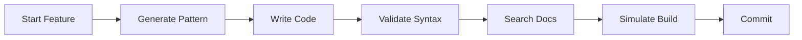

# RobloxTS MCP Server - Complete Usage Guide

## ✅ **YES! You can absolutely use this MCP server in all your other projects!**

Your RobloxTS MCP server is designed to be reusable and can enhance any Roblox-ts project with:

- 🔧 **Code validation and best practices**
- 📚 **Pattern generation for common features** 
- 🌐 **Live Roblox documentation access**
- 🏗️ **Build simulation and error checking**
- 💡 **Intelligent prompts and guidance**

---

## 🚀 Quick Setup for Any Project

### Method 1: Global Installation (Recommended)

```bash
# Install once, use everywhere
cd /path/to/roblox-ts-mcp
npm pack  # Creates roblox-ts-mcp-1.0.0.tgz
npm install -g ./roblox-ts-mcp-1.0.0.tgz

# Now use in any project
roblox-ts-mcp
```

### Method 2: Local Project Installation

```bash
# In any Roblox-ts project
npm install --save-dev /path/to/roblox-ts-mcp

# Use via npm script
npm run mcp  # if added to package.json
```

### Method 3: Direct Node Usage

```bash
# Run directly from anywhere
node /path/to/roblox-ts-mcp/bin/roblox-ts-mcp.js
```

---

## 🔌 AI Client Integration

### Claude Desktop

```json
// ~/.claude_desktop_config.json
{
  "mcpServers": {
    "roblox-ts": {
      "command": "node",
      "args": ["/absolute/path/to/roblox-ts-mcp/bin/roblox-ts-mcp.js"]
    }
  }
}
```

### Continue.dev

```json
// .continuerc.json in your project
{
  "mcpServers": [
    {
      "name": "roblox-ts",
      "command": "node",
      "args": ["/path/to/roblox-ts-mcp/bin/roblox-ts-mcp.js"]
    }
  ]
}
```

### VS Code with MCP Extension

```json
// VS Code settings.json
{
  "mcp.servers": {
    "roblox-ts": {
      "command": "node",
      "args": ["/path/to/roblox-ts-mcp/bin/roblox-ts-mcp.js"],
      "description": "Roblox-ts development assistant"
    }
  }
}
```

---

## 🎯 Project Type Examples

### 🎮 Game Development Project

```bash
# Example: Tower Defense Game
cd my-tower-defense
npm install --save-dev /path/to/roblox-ts-mcp

# Use MCP to generate:
# - Networking patterns for multiplayer
# - Player data management
# - UI components with Fusion
# - Zone detection for tower placement
```

**Generated patterns you can use:**
- `generate-pattern networking` → Type-safe RemoteEvents
- `generate-pattern player-data` → ProfileStore setup  
- `generate-pattern ui` → Reactive UI with Fusion
- `generate-pattern zone` → Zone-Plus integration

### 📚 Library Development

```bash
# Example: Creating @rbxts/my-library
cd my-rbxts-library
npm install --save-dev /path/to/roblox-ts-mcp

# Use MCP for:
# - Syntax validation
# - API documentation lookup
# - Best practices compliance
```

### 🏫 Learning/Educational Projects

```bash
# Example: Roblox-ts Tutorial Series
cd roblox-ts-tutorials
npm install --save-dev /path/to/roblox-ts-mcp

# Benefits:
# - Consistent code examples
# - Real-time documentation
# - Pattern templates for lessons
```

---

## 🛠️ Available Tools Across Projects

### Code Quality Tools

| Tool | Purpose | Example Usage |
|------|---------|---------------|
| `validate-syntax` | Check Roblox-ts compliance | Validate before commits |
| `simulate-build` | Test compilation | Pre-deployment checks |

### Documentation Tools  

| Tool | Purpose | Example Usage |
|------|---------|---------------|
| `search-roblox-docs` | Find Roblox API docs | Quick reference lookup |
| `summarize-roblox-doc` | Get doc summaries | Understand new features |

### Code Generation Tools

| Tool | Purpose | Example Usage |
|------|---------|---------------|
| `generate-pattern` | Create boilerplate | Networking, UI, data patterns |

---

## 📋 Integration Workflows

### Development Workflow



### Team Development

1. **Setup**: All team members use same MCP server version
2. **Standards**: Use `generate-pattern` for consistent code structure  
3. **Reviews**: Validate with `validate-syntax` before PRs
4. **Documentation**: Reference official docs with `search-roblox-docs`

---

## 🔧 Advanced Configuration

### Project-Specific Settings

Create `.roblox-ts-mcp.json` in project root:

```json
{
  "patterns": {
    "preferred": ["fusion", "net", "profile-store"],
    "custom": ["my-pattern"]
  },
  "validation": {
    "strict": true,
    "enforceServices": true
  },
  "docs": {
    "cache": true,
    "timeout": 10000
  }
}
```

### Environment Variables

```bash
# Control MCP server behavior
export ROBLOX_MCP_CACHE_SIZE=100
export ROBLOX_MCP_TIMEOUT=15000
export ROBLOX_MCP_DEBUG=true
```

---

## 🌍 Multi-Project Management

### Shared Configuration

```bash
# Create global config
mkdir -p ~/.config/roblox-ts-mcp
echo '{"defaultLibraries": ["net", "fusion"]}' > ~/.config/roblox-ts-mcp/config.json
```

### Project Inheritance

Projects can inherit global settings and override as needed:

```json
// Project-specific overrides
{
  "extends": "~/.config/roblox-ts-mcp/config.json",
  "patterns": {
    "additional": ["zone-plus"]
  }
}
```

---

## 🔄 Version Management

### Keeping Updated

```bash
# Check current version
roblox-ts-mcp --version

# Update global installation
npm update -g roblox-ts-mcp

# Update project-specific
npm update roblox-ts-mcp
```

### Version Compatibility

- **Node.js**: Requires Node 16+
- **Roblox-ts**: Compatible with all versions
- **@rbxts packages**: Supports latest versions

---

## 🎪 Real-World Examples

### Example 1: Existing Game Migration

```bash
# Migrate existing Roblox game to use MCP
cd existing-game
npm install --save-dev /path/to/roblox-ts-mcp

# Use tools to:
# 1. Validate current code: validate-syntax
# 2. Generate missing patterns: generate-pattern networking  
# 3. Look up APIs: search-roblox-docs "DataStore"
# 4. Test builds: simulate-build
```

### Example 2: Team Onboarding

```bash
# New team member setup
git clone team-project
cd team-project
npm install  # Includes MCP server

# Configured in package.json:
{
  "scripts": {
    "help": "echo 'Use Roblox-ts MCP tools for development assistance'"
  }
}
```

### Example 3: CI/CD Integration

```yaml
# .github/workflows/validate.yml
name: Validate Roblox-ts Code
on: [push, pull_request]
jobs:
  validate:
    runs-on: ubuntu-latest
    steps:
      - uses: actions/checkout@v3
      - name: Setup Node
        uses: actions/setup-node@v3
      - name: Install MCP
        run: npm install -g ./roblox-ts-mcp
      - name: Validate syntax
        run: |
          # Use MCP validation in CI
          echo "Syntax validation via MCP tools"
```

---

## ✅ **Summary: Your MCP Server is Ready for Multi-Project Use!**

🎯 **Installation**: Multiple methods (global, local, direct)  
🔌 **Integration**: Works with all major AI clients  
🚀 **Scalable**: Use across unlimited projects  
🛠️ **Flexible**: Configurable per project needs  
🌐 **Universal**: Compatible with any Roblox-ts project  

**Start using it in your other projects today!** 🚀

---

*Need help? Check the [Integration Guide](./INTEGRATION.md) or create an issue on GitHub.*
