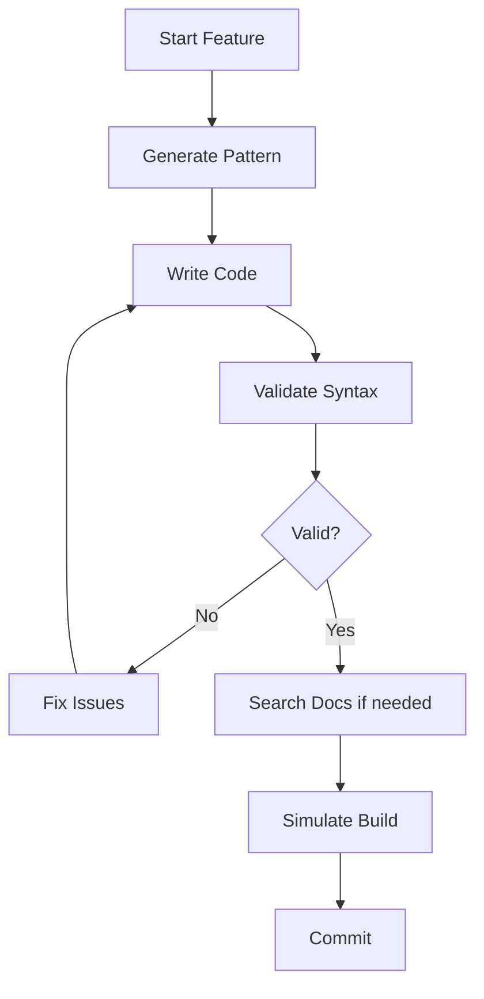

# RobloxTS MCP Server - Project Integration Guide

## Quick Start

### 1. Install the MCP Server

```bash
# Option A: Install globally (recommended)
npm install -g roblox-ts-mcp

# Option B: Install locally in your project
npm install --save-dev roblox-ts-mcp
```

### 2. Configure Your AI Client

#### Claude Desktop

Add to `~/.claude_desktop_config.json`:

```json
{
  "mcpServers": {
    "roblox-ts": {
      "command": "roblox-ts-mcp"
    }
  }
}
```

#### Continue.dev

Add to `.continuerc.json` in your project:

```json
{
  "mcpServers": [
    {
      "name": "roblox-ts",
      "command": "roblox-ts-mcp"
    }
  ]
}
```

#### VS Code with MCP Extension

Add to VS Code settings:

```json
{
  "mcp.servers": {
    "roblox-ts": {
      "command": "roblox-ts-mcp",
      "description": "Roblox-ts development assistant"
    }
  }
}
```

## Integration Examples

### Example 1: New Roblox Game Project

```bash
# 1. Create new Roblox-ts project
npx create-roblox-ts my-game
cd my-game

# 2. Install MCP server
npm install --save-dev roblox-ts-mcp

# 3. Configure your AI client (see above)

# 4. Start using MCP features
# - Generate networking patterns
# - Validate syntax
# - Search Roblox docs
# - Generate UI components
```

### Example 2: Existing Project Integration

```bash
# 1. Navigate to existing project
cd my-existing-game

# 2. Install MCP server
npm install --save-dev roblox-ts-mcp

# 3. Add to package.json scripts
{
  "scripts": {
    "mcp": "roblox-ts-mcp",
    "validate": "echo 'Use MCP validate-syntax tool'"
  }
}
```

### Example 3: Team Development Setup

```bash
# 1. Add to project's package.json
npm install --save-dev roblox-ts-mcp

# 2. Create .mcprc.json in project root
{
  "servers": {
    "roblox-ts": {
      "enabled": true,
      "patterns": ["**/*.ts"],
      "features": {
        "validation": true,
        "docs": true,
        "patterns": true
      }
    }
  }
}

# 3. Document in README.md
## Development Setup
1. Install dependencies: `npm install`
2. Configure MCP: Use the roblox-ts MCP server for consistent patterns
```

## Available Commands

Once installed, you can use these MCP tools:

### 🔧 Development Tools

- **`validate-syntax`** - Check code quality and @rbxts compliance
- **`generate-pattern`** - Create boilerplate for common features
- **`simulate-build`** - Test TypeScript compilation

### 📖 Documentation Tools

- **`search-roblox-docs`** - Find official Roblox documentation
- **`summarize-roblox-doc`** - Get summaries of doc pages

### 📚 Knowledge Resources

- **Syntax Guide** - Roblox-ts best practices
- **Design Patterns** - Architecture guidance  
- **Library Guide** - @rbxts package recommendations

## Project Workflow Integration

### Development Workflow



### Code Review Workflow

1. **Pre-commit**: Use `validate-syntax` tool
2. **Pattern Check**: Ensure consistent patterns via `generate-pattern`
3. **Documentation**: Reference official docs via `search-roblox-docs`
4. **Build Check**: Simulate compilation with `simulate-build`

## IDE Integration

### VS Code

Create `.vscode/tasks.json`:

```json
{
  "version": "2.0.0",
  "tasks": [
    {
      "label": "Validate Roblox-ts Syntax",
      "type": "shell",
      "command": "echo 'Use MCP validate-syntax tool'",
      "group": "build"
    }
  ]
}
```

### WebStorm/IntelliJ

Add external tool configuration for MCP server integration.

## Multi-Project Usage

### Shared Configuration

Create `~/.roblox-ts-mcp.json`:

```json
{
  "defaultPatterns": {
    "networking": "@rbxts/net",
    "data": "@rbxts/profile-store",
    "ui": "@rbxts/fusion",
    "zones": "@rbxts/zone-plus"
  },
  "validation": {
    "strict": true,
    "enforceServices": true
  }
}
```

### Project-Specific Overrides

In each project's `package.json`:

```json
{
  "mcpConfig": {
    "patterns": ["custom-pattern"],
    "features": ["validation", "docs"]
  }
}
```

## Troubleshooting

### Common Issues

1. **MCP Server Not Found**
   ```bash
   # Check installation
   npm list -g roblox-ts-mcp
   
   # Reinstall if needed
   npm uninstall -g roblox-ts-mcp
   npm install -g roblox-ts-mcp
   ```

2. **Permission Issues**
   ```bash
   # Windows
   npm config set prefix C:\Users\{username}\npm-global
   
   # macOS/Linux  
   sudo npm install -g roblox-ts-mcp
   ```

3. **AI Client Not Recognizing Server**
   - Restart your AI client after configuration
   - Check JSON syntax in config files
   - Verify file paths

### Getting Help

- Check the [GitHub Issues](https://github.com/your-username/roblox-ts-mcp/issues)
- Review the [Usage Guide](./USAGE.md)
- Test with `roblox-ts-mcp --version`

## Best Practices

1. **Use in Team Projects**: Ensure all team members use the same MCP server version
2. **Regular Updates**: Keep the server updated for latest Roblox features
3. **Pattern Consistency**: Use `generate-pattern` for consistent code structure
4. **Documentation First**: Always search docs before implementing new features
5. **Validation Habit**: Run `validate-syntax` before committing code

---

*Happy coding with Roblox-ts! 🚀*
